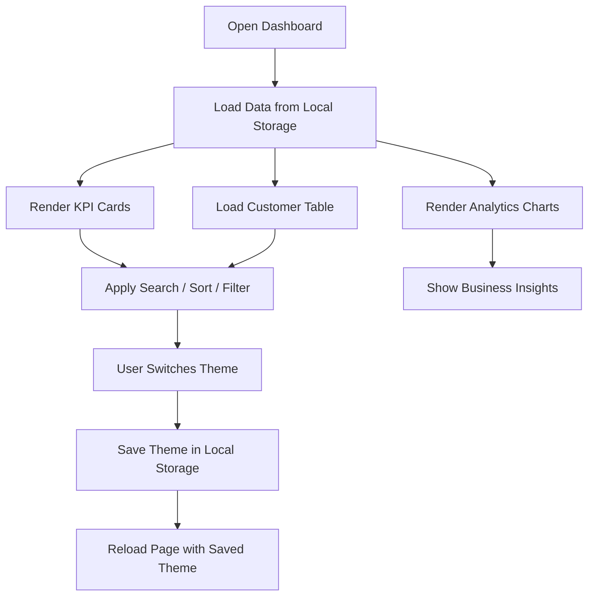
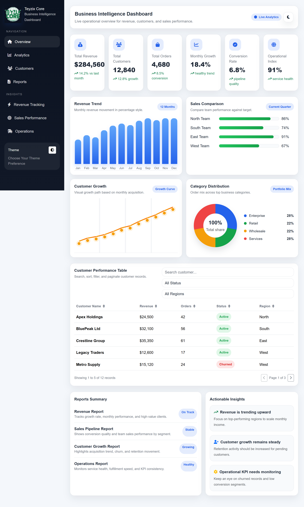
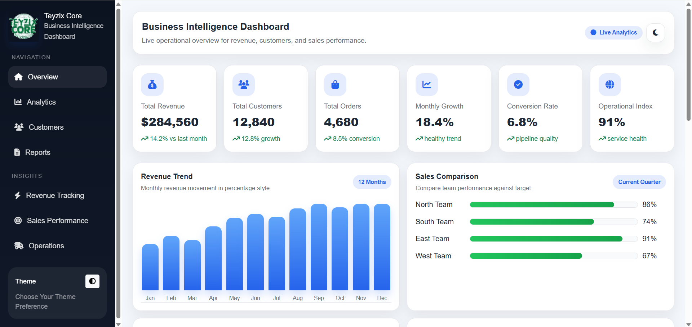
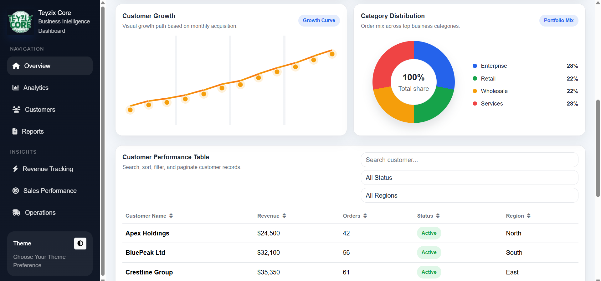
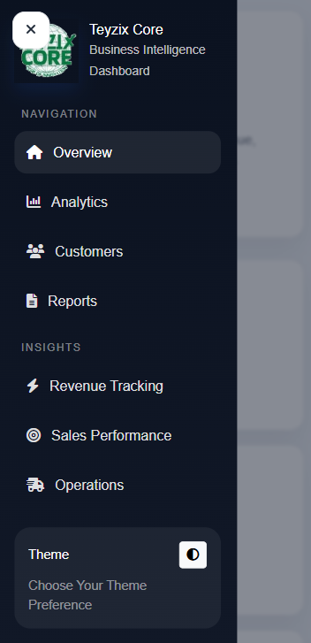

# TEYZIX CORE — Business Intelligence Dashboard

A professional, responsive Business Intelligence dashboard built to help management monitor **revenue, sales performance, customer growth, and operational KPIs** in real time.

This project is designed to simulate the experience of tools like **Power BI, Tableau, Zoho Analytics, and Google Looker Studio** while staying fully frontend-based with **HTML, CSS, Bootstrap, JavaScript, and Local Storage**.

---

## Project Overview

Organizations often struggle to visualize performance across multiple departments. This dashboard solves that problem by presenting key business data in a clean, modern, and interactive interface.

It includes:

- A professional **sidebar navigation**
- A polished **header section**
- **KPI cards** for executive-level monitoring
- A full **analytics area** with custom JavaScript charts
- A **reports section** for business summaries
- A **customer table** with search, sorting, filtering, and pagination
- **Light/Dark theme support** with persistence in Local Storage
- Full **responsive support** for desktop, tablet, and mobile

---

## Features

### Dashboard Layout
- Sidebar navigation
- Header section
- KPI cards
- Analytics area
- Reports section

### KPI Overview
- Total Revenue
- Total Customers
- Total Orders
- Monthly Growth
- Conversion Rate
- Operational Index

### Interactive Charts
Built using **plain JavaScript** without chart libraries or frameworks:

- Revenue Trend Chart
- Sales Comparison Chart
- Customer Growth Chart
- Category Distribution Chart

### Data Table
Includes:
- Search
- Sorting
- Pagination
- Filtering

Table fields:
- Customer Name
- Revenue
- Orders
- Status
- Region

### Theme Management
- Light Mode
- Dark Mode
- Theme persistence using **Local Storage**

### Responsive Design
- Desktop
- Tablet
- Mobile

---

## Tech Stack

- **HTML5**
- **CSS3**
- **Bootstrap 5**
- **JavaScript (ES6+)**
- **Font Awesome**
- **Local Storage**

---

## Why This Project Stands Out

This dashboard is not just a static UI. It feels like a real management tool with:

- A strong executive-style layout
- Reusable JavaScript rendering logic
- Clean UI and readable structure
- Smooth theme switching
- Strong mobile responsiveness
- No API or database dependency

---

## How It Works

### 1. Load Data
The dashboard uses **Local Storage** to store sample data, so the page works without an API or database.

### 2. Render KPIs
The KPI cards are generated dynamically from the local data object.

### 3. Draw Charts
The charts are built using **basic JavaScript and HTML elements** only.

### 4. Manage Table
The customer table supports:
- live search
- column sorting
- filters
- pagination

### 5. Save Theme
The selected light or dark theme is saved in Local Storage and restored automatically on reload.

---

## Flowchart

---

## Screenshots

Add your screenshots manually in this section:

### 1. Home Dashboard

### 2. Analytics Section

### 3. Customer Table

### 4. Mobile View

---

## How to Use

1. Open the project in your browser
2. Explore the KPI cards and analytics charts
3. Use the table search bar, filters, sorting, and pagination
4. Toggle between light and dark mode
5. Refresh the page to confirm theme persistence

---

## Project Goal

The main goal of this project is to provide management with a strong visual decision-making tool that is:

- clean
- responsive
- interactive
- professional
- easy to understand

---

## Deliverables Included

- Responsive UI
- Source code
- Documentation
- Theme persistence
- Interactive charts
- Table controls
- Screenshot-ready layout

---

## Author Note

This project was created as a frontend business intelligence dashboard concept for management reporting and analytics visualization.

